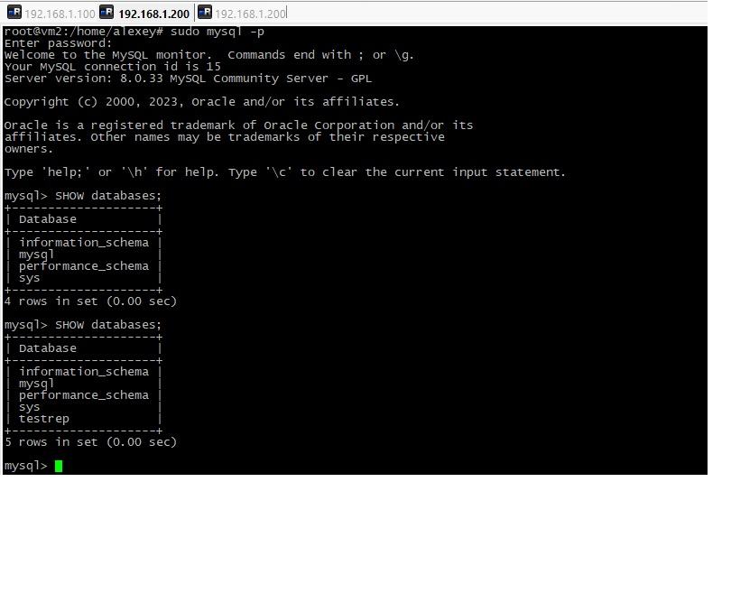

# Домашнее задание к занятию "`«Репликация и масштабирование. Часть 1»`" - `Дьяконов Алексей`


### Задание 1.  Опишите различия режимов репликации master-slave и  master-master.

`Основным отличием этих режимов является то, что при режиме master-slave информация пишется на мастер-ноду, а потом копируется на слейв-ноды. При master-master часть информации пишется на  одну мастер-ноду, а часть на другие. Затем они копируют информацию между собой(т.е. все ноды одновременно являются и мастером и слейвом)`


### Задание 2. Выполните конфигурацию master-slave репликации.

1. `Ставим MySQL с офсайта:`
```
    apt remove mariadb-common # если стоял mysql из репозитория
    sudo dpkg -i mysql-apt-config_0.8.22-1_all.deb
    apt update
    apt install mysql-server mysql-client 
    # здесь на одной виртуалке появился запрос на создание пароля, а на второй  - не появился))))

```

2. `Создаём директорию и меняем права  на обоих нодах (если не менять - получим ошибку чтения):`
```
 mkdir -p /var/log/mysql
 chown -R mysql: /var/log/mysql
 chown -R mysql: /var/lib/mysql 
```
3. `Инициализируем  на обоих нодах MySQL:`
```
 sudo mysqld --initialize  
 systemctl start mysql # в логе выводится временный пароль
```
 
3. `Правим конфигурацию на обоих нодах.`
```
    nano /etc/mysql/my.cnf
    
    [mysqld]
    bind-address=0.0.0.0
    server_id = 1 # на второй ноде - server_id = 2
    log_bin = /var/log/my.log
    log-error = /var/log/mysqld.log
    pid-file= /var/run/mysql/mysqld.pid
```
-
-


4. `Меняем пароль для ноды, где не  было запроса создания:`
```
    ALTER USER 'root'@'localhost' IDENTIFIED BY '12345678';
    FLUSH PRIVILEGES;
```
5. `Создаём учетную запись  для репликация на обоих нодах:`

```
    CREATE USER 'rep'@'%' IDENTIFIED WITH mysql_native_password BY 'my_password';
    GRANT REPLICATION SLAVE ON *.* TO 'rep'@'%';
```

6. `Перезапускаем MySQL на мастер-ноде  и проверяем:`

```
    systemctl restart mysqld
    sudo mysql
    SHOW MASTER STATUS;
    # запоминаем название лога и позицию в нем
```
-

7. `Настраиваем репликацию на слейве:`
```
    CHANGE MASTER TO MASTER_HOST='192.168.1.100', 
    MASTER_USER='rep', MASTER_PASSWORD='my_password', MASTER_LOG_FILE='my.000002',
    MASTER_LOG_POS=741;

    START SLAVE;
    SHOW SLAVE STATUS\G;
```
-

8. `Создадим таблицу и проверим репликацию`

-
-


### Задание 3. Выполните конфигурацию master-master репликации.

1. `К выше изложенному добаляем на слейв-ноде из задания 2:`
```   
        SHOW MASTER STATUS;
```
-
2. `На мастер-ноде из задания 2:`
```
    CHANGE MASTER TO MASTER_HOST='192.168.1.200', 
    MASTER_USER='rep', MASTER_PASSWORD='my_password', MASTER_LOG_FILE='my.000005',
    MASTER_LOG_POS=157;

    START SLAVE;
    SHOW SLAVE STATUS\G;
```
-

3. `Создадим таблицу и проверим репликацию`

-
-